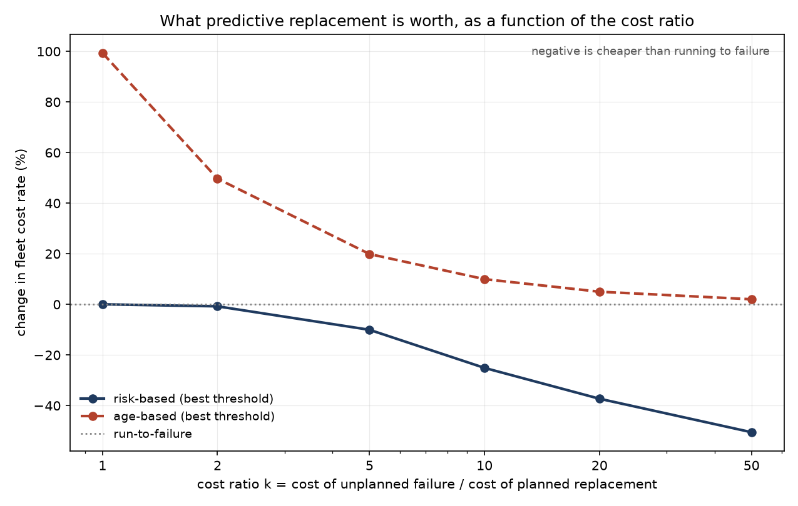
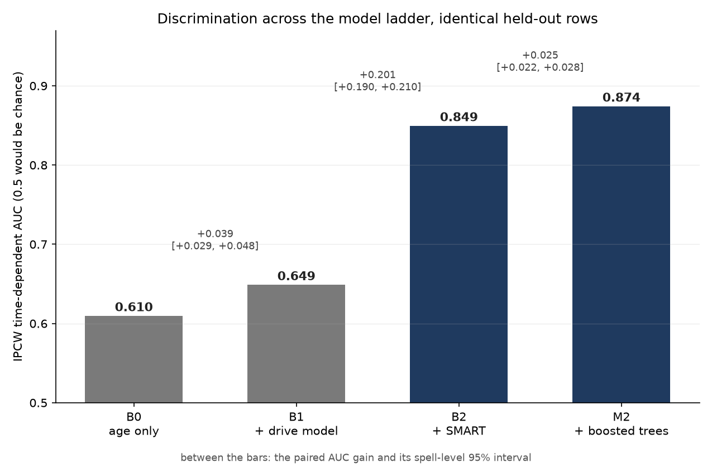
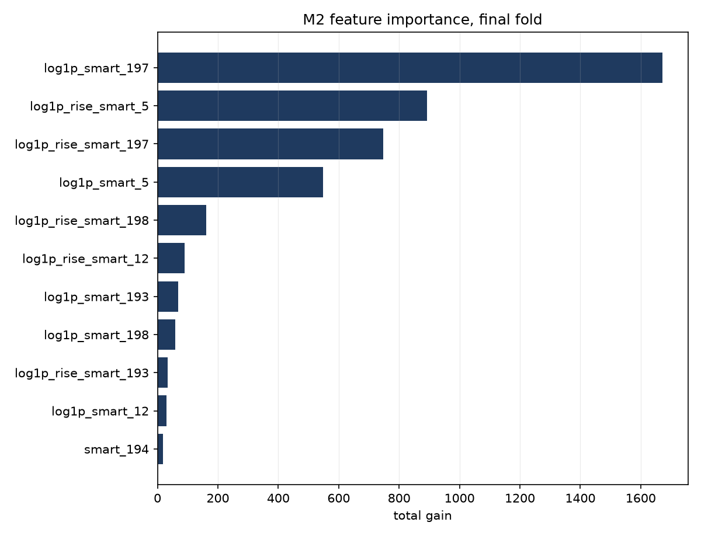
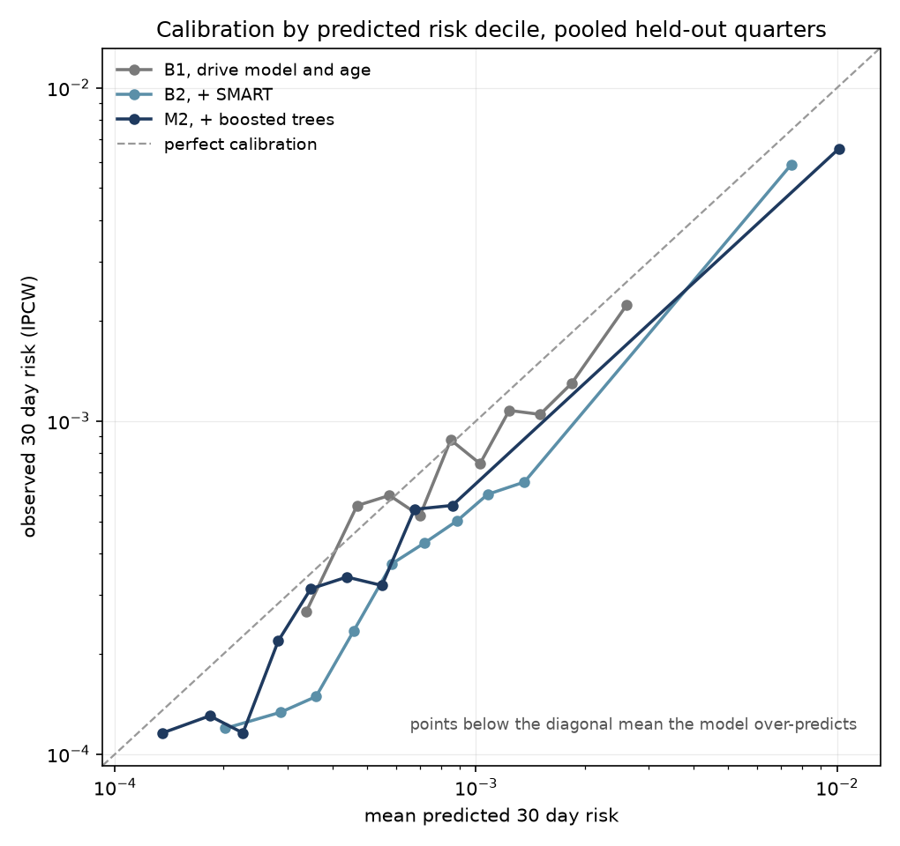
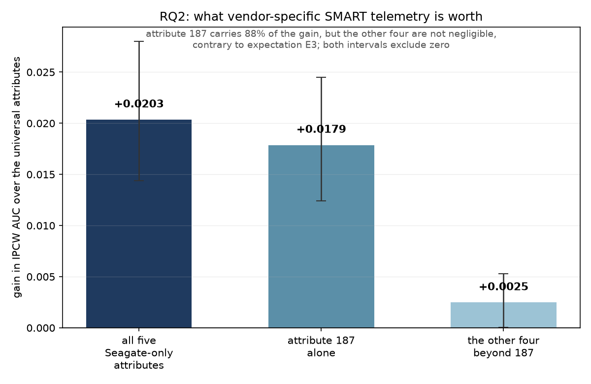
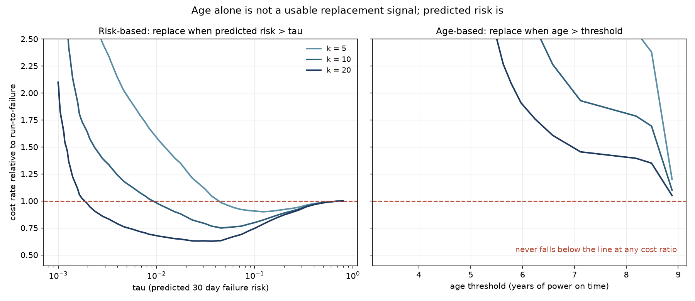
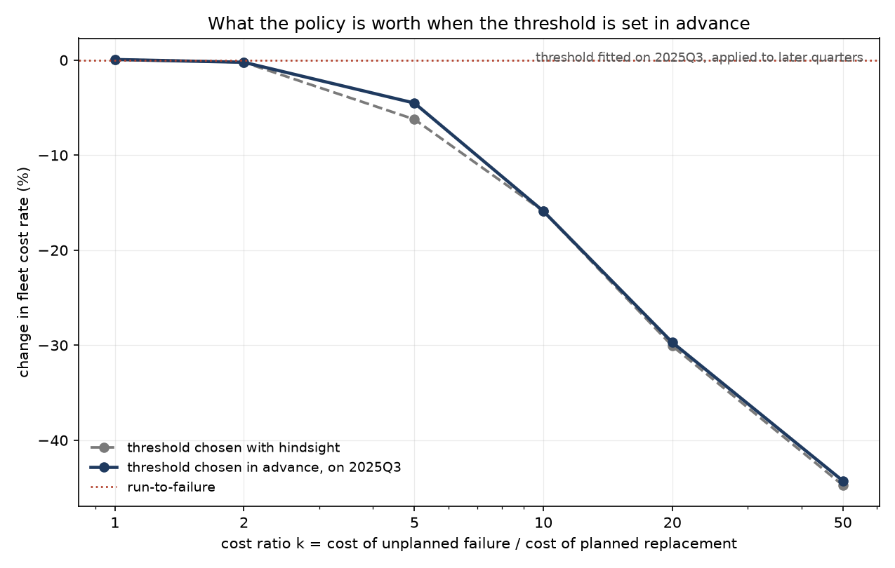
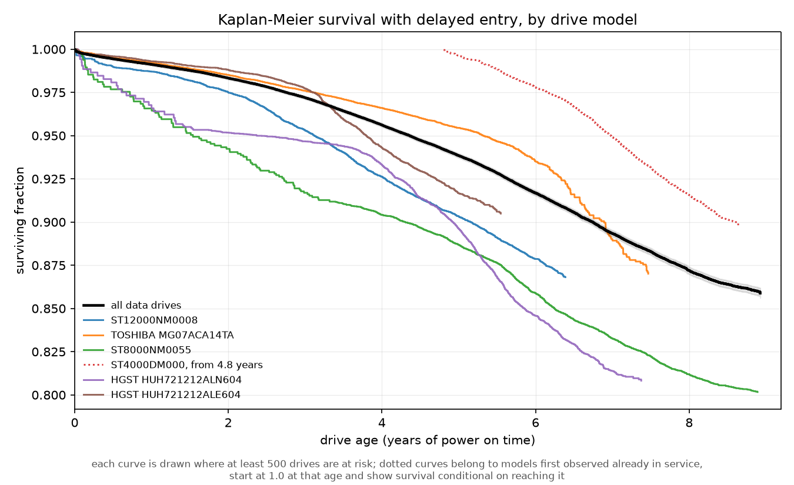
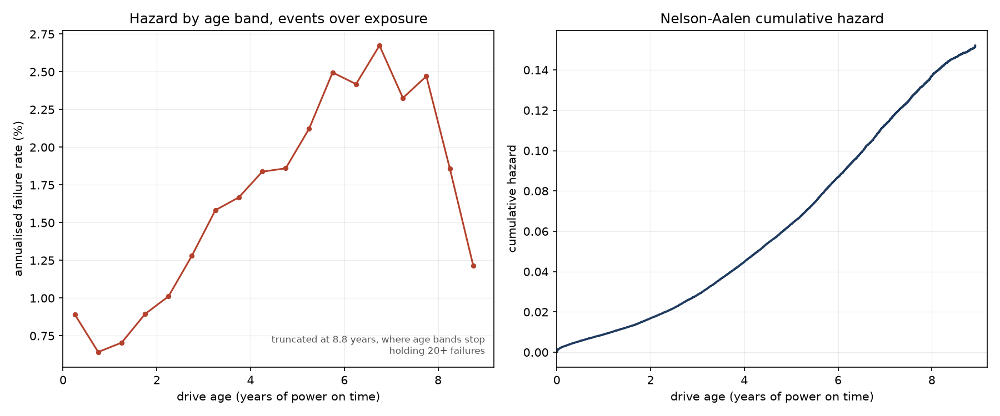
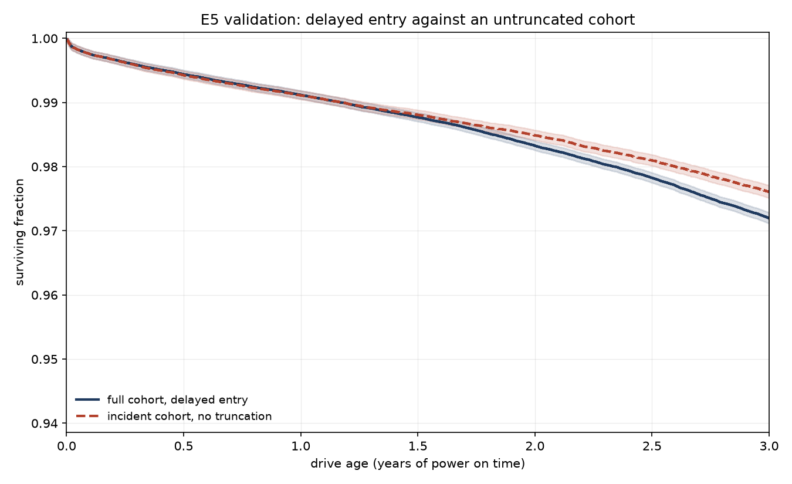

# Fleet reliability and replacement policy

**When should a datacenter replace a hard drive that has not failed yet?**

Twenty-one quarters of Backblaze Drive Stats, 2021 Q1 to 2026 Q1, covering 429,870
drives and 18,738 failures, framed as a survival analysis problem, turned into a
replacement policy and evaluated against the alternatives on quarters the models
never saw. **The test of the project's premise, fixed before the model existed,
failed.** Expectation E2 required SMART telemetry to improve on drive model and age
in both ranking and probability accuracy. It improves ranking by a wide margin (AUC
+0.20) but not the Brier score: no better on the original nine quarters, and
slightly but reliably worse on twenty-one. The loss disappears once each model's
overall level is corrected, which locates the problem. The telemetry ranks drives
well, and the probabilities it produces are pitched too high. The policy below is
built on the ranking, not on the probabilities.



**The answer.** If an unplanned failure costs ten times as much as a planned
replacement, replacing drives on predicted risk lowers the simulated fleet cost
rate by 25% over the three held-out quarters; by 10% at a cost ratio of 5, 37% at
20 and 51% at 50, and by under 1% at 2. These figures use the threshold that turned
out best on those quarters. Choosing it in advance, on an earlier quarter, costs at
most 1.7 percentage points. The saving also depends on how long the policy is
simulated: one quarter at a time it is 8 to 19% at a cost ratio of 10.

**The value comes from the telemetry.** The same policy run on the drive-model-and-age
model alone saves nothing up to a cost ratio of 20, and 0.7% at 50. Replacing on age
never pays at any cost ratio tested: the least costly age rule replaces the 2,428
oldest drives, none of which fails in the window.

---

## What this estimates

> The conditional probability that a drive **already in Backblaze's observed
> fleet** experiences a Backblaze-recorded failure within the next 30 days, given
> its accumulated power-on hours, drive model, and SMART telemetry up to the
> prediction time; and the use of those probabilities to evaluate cost-based
> replacement policies on temporally held-out quarters.

Three things it is not. Not hard drive lifespan from manufacture, since the data
begins when a drive enters the fleet and earlier history is unobserved. Not a
physical definition of failure, since failure is Backblaze's operational
determination. Not a statement about drives in general, since it describes one
operator's datacenters, workload and procurement.

## Scale

| | |
|---|---|
| source | Backblaze Drive Stats, 2021 Q1 to 2026 Q1, 21 quarters |
| drives / spells | 429,870 / 441,894 |
| sampled drive-day rows | 70.3 million, one day in seven, every failure row kept |
| failure events | 18,738 after splitting serial numbers into spells (19,245 raw flags on data drives) |
| landmark prediction rows | 17.0 million |
| validation | rolling origin, three held-out quarters: 2025 Q3, 2025 Q4, 2026 Q1 |

The ingest reproduces Backblaze's published figure of 1,030 failures for 2026 Q1
exactly.

About 3,200 failures were recorded in the three held-out quarters. The models are
scored on 2.9 million prediction rows from them, 2,667 of which see a failure within
30 days; that counts prediction rows, and one failure can fall inside the horizon of
two consecutive landmarks, which are 28 days apart. The policy simulation counts
failing drives instead: 2,446.

The project was first run on nine quarters, 2024 Q1 to 2026 Q1, and then extended
to twenty-one. Both sets of results are reported; see
[Pre-commitment](#pre-commitment).

---

## Results

### 1. SMART telemetry predicts which drives fail



All four models are scored on the same 2.9 million held-out rows, and each step
carries its paired, spell-level 95% interval. Drive age alone reaches an IPCW
time-dependent AUC of 0.610. Adding the drive model reaches 0.649. Adding SMART
attributes reaches 0.849, and replacing the log-linear form with boosted trees
reaches 0.874.

The step from 0.649 to 0.849 is the whole story. Everything after it is functional
form.

Current pending sector count (attribute 197) dominates, followed by the 30-day rise
in reallocated sectors (attribute 5) and the 30-day rise in pending sectors:



### 2. It does not predict how many will fail



The models that rank well over-predict the overall rate. Across the held-out rows
the observed 30-day risk is about 0.00092; B2 predicts 0.00134 on average and M2
0.00138, roughly half as much again. B1, which uses only drive model and age,
predicts 0.00112. For B2 the observed-to-predicted ratio stays between 0.41 and 0.79
in every decile, so the error is mostly in the level rather than the shape: the
ranking is right and the rate is too high.

The level cannot be fixed by fitting on the preceding quarter. The quarter-to-quarter
change in the fleet's failure rate has a standard deviation of about 21% on the log
scale, and over the longer window the rate also drifts: about 0.85 events per 1,000
landmark rows through 2021, 1.1 to 1.7 through 2023 and 2024, and 0.8 to 0.9 by the
end of 2025. A correction fitted on the previous quarter was tried on the
nine-quarter run, made calibration worse, and was removed; the attempt and the
evidence against it are in the repository.

The decision layer therefore does not read its threshold off the probabilities. It
chooses the threshold on realised cost, which absorbs a level error, and it sweeps
the level by 20% either way: the savings move by under half a percentage point.

### 3. Vendor-specific telemetry is worth about 2 AUC points



Attributes 187, 188, 190, 241 and 242 exist only on Seagate firmware. Fitted on the
same Seagate cohort, the universal-attribute model reaches AUC 0.855 and adding all
five reaches 0.875, a paired gain of +0.020 [+0.014, +0.028]. Attribute 187
(reported uncorrectable errors) carries 88% of it; the other four add +0.0025
[+0.00005, +0.0053], small but with an interval that excludes zero.

So a mixed-vendor fleet restricted to universally reported telemetry gives up about
two points, nearly all of which one Seagate attribute would recover. Two further
findings: on Seagate firmware attribute 190 is collinear with the universal
attribute 194 (correlation 1.0000 to four decimals) and contributes nothing, and 197
and 198 are identical within Seagate while differing across the full fleet.

### 4. Risk beats age, and age is worse than doing nothing



At a cost ratio of 10 the risk-based policy triggers 5,722 replacements. 1,204 are
drives observed to fail later in the window and 4,518 are not, so roughly one
replacement in five removes a drive before its observed failure.

Age fails for a reason visible in the hazard curve further down: the failure rate
peaks at about 6.75 years of power-on time and then falls, because the drives that
survive that long are the robust ones. The oldest drives are not the riskiest.

Drive model and age together do not rescue it. Run through the same simulator, a
policy on the B1 model's predictions finds no threshold that beats running to
failure at any cost ratio up to 20, and saves 0.7% at 50
(`reports/policy_b1/`).

**No intervention took place.** Every count of this kind is labelled *projected*.
If the policy would have replaced a drive on day 3 that was observed to fail on day
20, the correct statement is that the policy would have removed it from service
before its observed failure, not that a failure was avoided. That counterfactual was
never observed, and the replacement drive would carry its own risk.

### 5. Setting the threshold in advance, and how long to simulate

The headline figures choose the replacement threshold on the same quarters they
report, which uses the answer. `s11_prospective_policy.py` instead chooses it on
2025 Q3 and applies it unchanged to 2025 Q4 and 2026 Q1. Doing so costs 1.7
percentage points at a cost ratio of 5, at most 0.5 at 20 and 50, and nothing at 1, 2
and 10.



The simulated period matters more. `s11b_window_check.py` runs the hindsight-best
policy on every window the held-out data allows:

| window | failures per 100 drive-years | saving at k = 5 | at k = 10 | at k = 50 |
|---|---|---|---|---|
| 2025 Q3 | 1.30 | 7.8% | 18.7% | 45.4% |
| 2025 Q4 | 0.94 | 2.6% | 10.0% | 35.5% |
| 2026 Q1 | 1.09 | 1.7% | 7.5% | 36.9% |
| 2025 Q3 and Q4 | 1.11 | 7.4% | 20.9% | 48.0% |
| 2025 Q4 and 2026 Q1 | 1.01 | 6.2% | 15.9% | 44.7% |
| all three | 1.10 | 10.0% | 25.1% | 50.5% |

From a cost ratio of 10 up, adding a quarter to any window always increases the
saving; at 5 it does in every case but one (2025 Q3 alone against 2025 Q3 and Q4).
The mechanism is the accounting: a replacement is credited with any failure the
drive would have had later in the simulated period, not only within the 30-day
horizon, so a shorter window cuts that credit off sooner. The quarter matters too:
2025 Q3, which had the most failures, saves the most on its own, though the other
two single quarters do not consistently follow their failure rates.

The saving keeps rising with every quarter added, and no stable long-run value has
been shown. The three-quarter figures are the longest window available, and should
be quoted together with that length.

---

## Why the survival setup is not standard

A fixed-horizon binary classification of this data discards censored drives, which
are the large majority, and cannot answer *when*. Four things here are done
differently.

**Power-on hours as the time scale, with delayed entry.** 52.1% of drives were
already more than 30 days into service when first observed, most of them drives
standing in the fleet when the window opened in January 2021. Two naive alternatives
both go wrong. Starting the clock at first observation treats a drive that arrived
old as new, so its failures land at young ages and inflate the early hazard. Using
power-on hours but counting every drive as at risk from zero credits drives with
failure-free time before they were observed, which is immortal time, and deflates
it. Delayed entry avoids both.



**The hazard is not flat.** The annualised failure rate is 0.89% in the first half
year, falls to 0.64% at about nine months, rises to a peak of 2.67% at 6.75 years,
then declines to 1.22% by 8.75 years as the surviving population self-selects.



**Delayed entry is tested, and on the longer window the test does not fully pass.**
Two checks. First, the risk-set estimator agrees with a second estimator, built from
exposure rather than risk sets, to within 0.6% in every half-year band from six
months to eight years. The exceptions are the first half year, where the hazard falls
steeply inside the band and the two estimators, which weight time within a band
differently, differ by 25%, and the last two bands, where exposure thins, by up to
2.6%.

Second, expectation E5: within each installation year, the delayed-entry survival
estimate should agree with one fitted only on drives observed from new. On nine
quarters it did, once the comparison was restricted to the same installation
vintage. On twenty-one quarters it fails, under a rule written down before it ran: 6
of 20 comparisons fall outside the band.

| installation year | share observed from new | comparisons outside the band | largest gap in survival |
|---|---|---|---|
| 2020 | 9% | 4 of 4 | delayed entry 0.43 pp higher |
| 2021 | 79% | 0 of 4 | 0.05 pp |
| 2022 | 52% | 2 of 4 | delayed entry 0.55 pp lower |
| 2023 | 71% | 0 of 4 | 0.04 pp |
| 2024 | 93% | 0 of 4 | 0.01 pp |

Two things are known about the failures, and neither overturns the verdict. The 2020
comparison is not like for like at monthly resolution: because the data starts on 1
January 2021, the only 2020-installed drives that count as observed from new are
those installed in roughly the last month of 2020, compared against the whole year.
That is a flaw in how the test was designed, found after the result. The 2022 gap,
the larger one, is unexplained. What this affects is the lifetime survival curves
above; the prediction models do not rely on them, since each is fitted on the
exposure observed at each landmark.



**Censoring inside the horizon is handled, not ignored.** Drives leave the fleet
without failing about four times as often as they fail. Every metric uses inverse
probability of censoring weights, and uncertainty is bootstrapped at spell level
rather than row level, because one drive contributes many correlated landmark rows.

Whether that censoring is informative was tested rather than assumed. Drives removed
within 30 days carry roughly twice the prevalence of non-zero reallocated, pending and
offline-uncorrectable sector counts. Matched on drive model and age, that excess falls
to 0.08, 0.32 and 0.28 percentage points. Removals are also concentrated by model: in
17 of 21 quarters a single model accounts for at least half of all removals, which
points to wholesale retirement rather than selection on individual drives.

No competing risks model is fitted. Drives that stop appearing without a failure flag
are labelled "removed" here, but that label is inferred from their disappearance: the
data does not say why a drive left, so "removed" mixes retirements, migrations and
gaps in reporting. A subdistribution hazard model would treat that inference as an
observed cause of exit, which it is not.

---

## Pre-commitment

Every directional expectation was written into `DESIGN.md` and committed to git
**before** the model it concerns was fitted. Anyone can check that no expectation was
edited after its result; this prints every commit that ever touched them:

```
git log -L "/^## 9\./,/^## 10\./:DESIGN.md"
```

The window was extended from nine quarters to twenty-one after the nine-quarter
verdicts were known, so the second run is a re-test, not a fresh pre-commitment.
`DESIGN.md` section 13a records that, commits to reporting both sets side by side, and
rules out extending the window again in search of a different answer.

| | expectation | 9 quarters | 21 quarters |
|---|---|---|---|
| E1 | drive model adds to age | **held** | **held** |
| E2 | SMART adds to drive model and age | **failed** | **failed** |
| E3 | vendor attributes add, mostly via 187 | **held**, directional half wrong | **held**, directional half wrong |
| E4 | boosting adds a small margin over the linear form | **held** | **held** |
| E5 | delayed entry agrees with drives observed from new | **held** once compared like for like | **failed** |
| E6 | proportional hazards is rejected | superseded by a frame change | superseded |

**E2** had three conditions: AUC improves, Brier improves, and calibration does not
degrade. AUC improved by +0.187 on nine quarters and +0.201 [+0.190, +0.210] on
twenty-one. Brier did not improve on nine quarters and was reliably worse on
twenty-one, +1.86e-05 [+7.1e-06, +3.1e-05], which fails E2 on its own. Calibration
depends on how it is read. The spread of the decile ratios narrowed from 0.494 for B1
to 0.375 for B2, but B2's ratios all sit below 1 while B1's straddle it, so the level
got worse; the criterion did not say which reading governs. The nine-quarter run
recorded calibration as degraded using B1 and B2 scored on different rows, a defect
found later that cannot be recomputed because those predictions were overwritten.
With each model's level corrected on the test rows, a diagnostic that uses the
answer, B2's Brier loss disappears: −7.8e-06 [−1.6e-05, +1.3e-07].

**E3.** The gain is +0.025 on nine quarters and +0.020 on twenty-one, with attribute
187 carrying 72% and then 88% of it. "The other four contribute little" was tested as
"their added gain is not distinguishable from zero", and it is distinguishable both
times, so that half fails on significance rather than on size.

**E4.** +0.029 on nine quarters and +0.025 [+0.022, +0.028] on twenty-one. Boosting
also improves Brier on twenty-one quarters, raw and at oracle level. The expectation
that M2 is no better calibrated was wrong on nine quarters (it came out better) and
right on twenty-one (spread 0.375 for B2 against 0.387 for M2).

`DESIGN.md` section 14 records each verdict in full. Section 13 logs every amendment
with its date, its reason, and what had been fitted or read at the time, including
the defects found after results: two comparisons scored on mismatched rows, a drive
model missing a feature that went unnoticed on the first run, a threshold grid too
coarse at low cost ratios, and the accounting effect that changes how the savings
should be quoted. Several were found by an independent review of the finished
documents.

---

## Reproducing

The data is not in this repository. It is gitignored.

Commands below use the Windows `py` launcher, which is what the committed results
were produced with. On macOS or Linux substitute `python3` for `py`.

```
py -m pip install -r requirements.txt
mkdir data\zips data\parquet reports figures
```

Download the 21 quarterly archives from
[Backblaze Drive Stats](https://www.backblaze.com/cloud-storage/resources/hard-drive-test-data),
`data_Q1_2021` through `data_Q1_2026`, into `data/zips`. The ingest processes one
quarter at a time and extracts only ten daily files at a time, deleting each batch
before the next, so a fully expanded archive is never on disk at once.

```
py scripts\s0_ingest.py           --zips data/zips --out data/parquet
py scripts\s0_diagnose.py         --parquet data/parquet --reports reports
py scripts\s1_build_tables.py     --parquet data/parquet --out data/tables --reports reports
py scripts\s1b_coverage_audit.py
py scripts\s2_censoring_check.py
py scripts\s3_b0_baseline.py
py scripts\s3b_vintage_check.py   # E5, like for like by installation year
py scripts\s4_b1_baseline.py
py scripts\s5_b2_smart.py
py scripts\s6_b3_seagate.py
py scripts\s6b_design_check.py
py scripts\s7_horizon_check.py
py scripts\s8_m2_boosted.py       # writes the held-out predictions
py scripts\s9_decision_layer.py   # requires s8
py scripts\s9_decision_layer.py --risk-col risk_b1 --reports reports\policy_b1 --figures figures\policy_b1
py scripts\s10_summary_figures.py
py scripts\s11_prospective_policy.py
py scripts\s11b_window_check.py
```

All scripts default to `data/tables`, `reports` and `figures`. Every number in this
README is written to a CSV in `reports/` or computed directly from one, so any claim
here can be checked against the file that produced it. The bootstraps and the boosted
trees are seeded; rerunning s5 and s8 reproduced every number they report exactly.

No survival analysis library is used. Kaplan-Meier with delayed entry, Nelson-Aalen,
the IPCW Brier score, time-dependent AUC and the penalised Poisson hazard model are
implemented directly in `scripts/evaluation.py` and the model scripts. Correct
handling of left truncation and of censoring inside the horizon is a central claim
here, so those computations are visible rather than delegated.

---

## Limitations

1. **Failure time is interval-censored.** One snapshot per day, so a failure falls somewhere inside a 24-hour window. Immaterial against lifetimes in tens of thousands of hours.
2. **The reason a drive leaves the fleet is not published.** Tested rather than assumed and found close to conditionally independent given drive model and age. Not entirely: in the model-by-age cells reported, those where removed drives show a health excess above one percentage point hold about 6% of removed rows.
3. **3.3% of events fall into no landmark window** (627 of 18,738) and are invisible to every model. In the three test quarters it is 238 events, rising from 4.1% to 12.3% of each quarter's events; 180 are assigned to the staleness rule, 51 had spells too short for any landmark and 7 entered after the last one. The staleness category is the audit's residual, assigned when no other cause fits, and why it concentrates in 2026 Q1 was not determined. **The model does not address infant mortality**: drives failing within days of installation fall outside a landmark framework, and no claim is made about them.
4. **Individual hazard ratios are not interpretable.** SMART counters are collinear, which produces sign flips. The predictive comparisons are reportable; the coefficients are not.
5. **The models over-predict the overall failure rate by about half.** The policy is built to tolerate this (Results, section 2), but the probabilities should not be read as calibrated rates.
6. **Savings depend on the simulated period** (Results, section 5). They are quoted over three quarters, the longest held-out period available, and no stable long-run value has been shown.
7. **The simulator removes a replaced drive and does not model its replacement.** The replacement drive's own failure risk and its added service time are both omitted. At a cost ratio of 10 the policy removes about 1% of drive-years, so the effect is likely small, but its direction was not measured.
8. **E5 fails on the twenty-one-quarter window** for the 2020 and 2022 installation years, so the delayed-entry survival curves are not validated for those vintages.
9. **The cost ratio is not public.** All monetary quantities are in units of one planned replacement, and the ratio is swept rather than invented.
10. **One operator, one workload, one procurement history.**

## Deliberately not done

Deferred and not a condition of completion: DeepHit and other deep survival models,
shared frailty by manufacturing batch, landmark supermodels.

Removed during the work, with reasons logged: Fine-Gray, because the data carries no
observed cause-of-exit label; and Random Survival Forest, because it could not be
fitted on the same rows as the rest of the ladder and is not an independent model
family from the boosted trees.

Planned in `DESIGN.md` and not done, recorded there rather than dropped silently: a
sensitivity fit including the Toshiba models excluded for not reporting attribute
197, Uno's concordance, and calibration slope and intercept.

Out of scope by design: serving infrastructure, orchestration, monitoring, retraining
pipelines. This is a data science project.

---

## Repository

```
DESIGN.md              pre-committed design, amendment log, results against expectations
requirements.txt
scripts/               s0 ingest through s11b, plus evaluation.py
reports/               every table behind every number in this README
reports/policy_b1/     the same policy run on drive model and age alone
figures/
data/                  gitignored
```

Data from [Backblaze Drive Stats](https://www.backblaze.com/cloud-storage/resources/hard-drive-test-data),
used under their terms.
